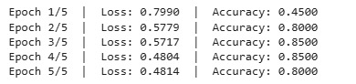

# Transfer-Learning-for-Classification-using-Hugging-Face-API
# 🎬 BERT Sentiment Analysis (Transfer Learning)

## 📌 Project Overview

This project implements *Sentiment Analysis on Movie Reviews* using *BERT (Bidirectional Encoder Representations from Transformers)* with transfer learning.

The model classifies reviews into:

* ✅ Positive
* ❌ Negative

---

## 🚀 Features

* Uses pretrained BERT model (bert-base-uncased)
* Fine-tuned on custom dataset
* High accuracy even with small data
* Built using PyTorch and Hugging Face Transformers

---

## 🧠 Model Architecture

* Tokenizer: BERT Tokenizer
* Model: BERT for Sequence Classification
* Optimizer: AdamW
* Loss Function: Cross Entropy

---

## 📂 Project Structure

├── bert_sentiment.ipynb
├── README.md
├── requirements.txt
└── images/

---

## ⚙️ Installation

bash
pip install transformers torch datasets

---

## ▶️ How to Run

1. Open the notebook
2. Run all cells
3. Train the model
4. Test predictions

---

## 📊 Results

* Achieved high training accuracy
* Correctly classified sentiment
* Loss reduced over epochs
* Efficient using transfer learning

---

## 🖼️ Sample Output

.png)

---

## 📌 Future Improvements

* Use larger dataset
* Add validation/testing split
* Deploy as web app

---
